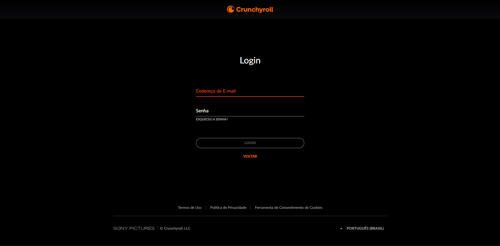

# [Trabalho Individual - P1](/aula01/desafio_p1)

Este repositório contém a resolução do desafio prático do primeiro desafio P1, um projeto individual desenvolvido em React com JavaScript para fins acadêmicos. O objetivo principal é replicar de forma fidedigna uma página de login existente (clonagem) e aplicar conceitos fundamentais de gerenciamento de estado e ciclo de vida do React.

## Página de Login Clonada
O desafio consiste em reconstruir uma interface de login com base em uma referência visual, aplicando boas práticas de estilização isolada e lógica de componentes.



---

## Requisitos Técnicos & Lógica Implementada

- **Gerenciamento de Estado (`useState`):** Utilizado para capturar, armazenar e gerenciar de forma reativa os dados de entrada dos campos de `login` e `senha`.
- **Efeito de Validação (`useEffect`):**
  - Implementação de um botão de ação que altera o estado de uma variável gatilho.
  - Um hook `useEffect` monitora essa variável e dispara a validação lógica para checar se as credenciais digitadas de login e senha estão corretas.
- **Estilização com CSS Modules (`styles.module.css`):** Escopo local de estilos garantido via CSS Modules, estruturado de forma organizada *(seguindo boas práticas de organização de classes)*.
- **Evidência de Clonagem:** A imagem de referência utilizada como base para o clone está incluída na raiz ou na pasta de assets deste repositório para fins de comparação e avaliação.

---

## 🚀 Como Executar o Projeto

1. **Clone este repositório:**
   ```bash
   git clone https://github.com/Phonedison/aula_react.git
   ```

2. **Acesse o diretório do projeto:**
   ```bash
   cd desafio_p1
   ```

3. **Instale as dependências:**
   ```bash
   npm install
   # ou
   yarn install
   ```
   
4. **Inicie o servidor de desenvolvimento:**
   ```bash
   npm run dev
   # ou
   yarn dev
   ```

> 💡 Nota: Para visualizar a validação e os dados digitados nos campos de input, abra o Console do Desenvolvedor (F12 ou Ctrl + Shift + I) no seu navegador após clicar no botão de ação.
   
---
## ✒️ Autor
Desenvolvido por **Lucas Leal da Silva** (Phonedison).
